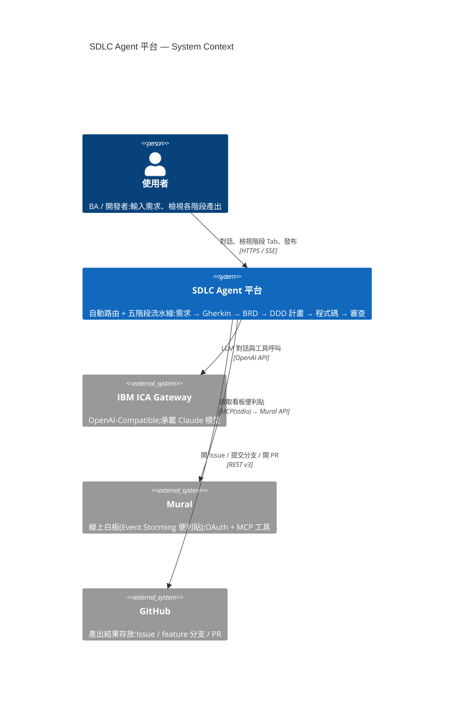
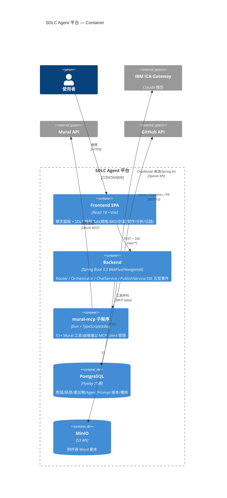
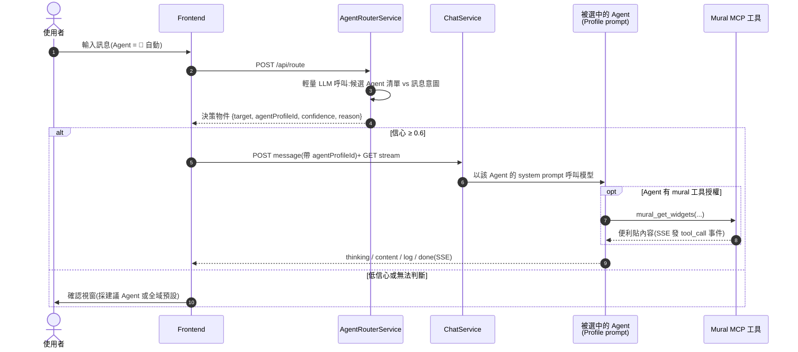
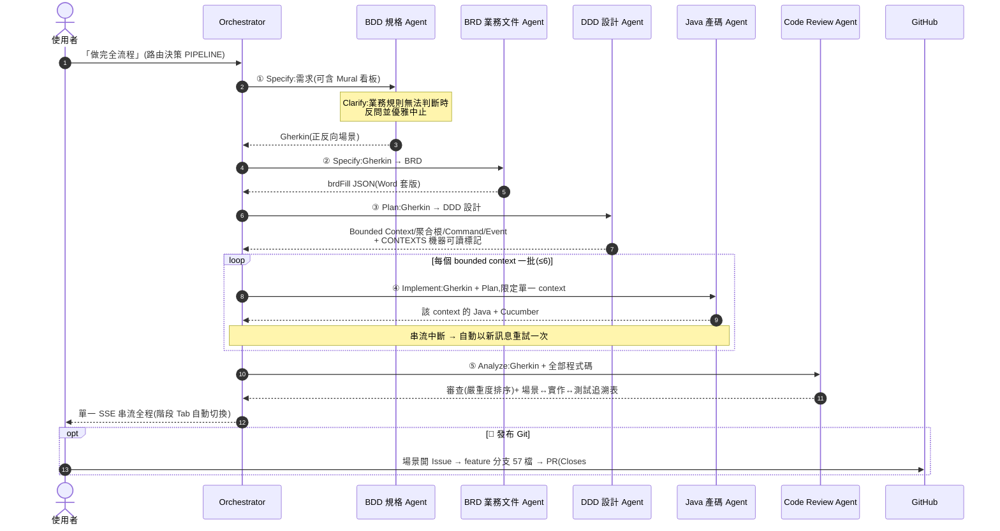

# gherkins-converter — LLM Agent Web Platform

類 Open WebUI 的多模型 AI Agent 平台:透過 **IBM ICA(OpenAI-Compatible Gateway)** 呼叫**最新 Claude 模型**,
以 SDLC 場景為核心 —— 對話產出 **Gherkin 規格、業務需求 Word 文件、Java + Cucumber 程式碼**,
串流即時呈現思考過程與日誌。

> 本 README 兼作教學文件:從「一個實際場景」出發,說明每個功能背後的**原理**與**對應程式碼**,
> 讀者可以按「學習路徑」順讀 codebase。完整規劃見 `docs/00-評估規劃書.md`,架構決策見 `docs/adr/`,任務見 `docs/tasks/TASKS.md`。

---

## 1. 使用場景:三步驟 SDLC(任何業務需求皆適用)

同一個對話中依序送出三個 prompt(或以 🤖 自動路由/全流程一句話完成),
Agent 逐步完成「規格 → 需求文件 → 程式碼」。需求來源可以是文字敘述、附件
(.docx / 文字檔)或 **Mural 線上白板**(Event Storming 便利貼):

| 步驟 | Prompt 要求 | 產出 |
|------|------------|------|
| Step 1 | 將業務情境轉為 Gherkin,加入**正反向條件** | zh-TW `.feature`(正向/例外/邊界情境、場景大綱) |
| Step 2 | 根據 Step 1 撰寫**業務需求文件**(Word 格式) | 結構化 BRD → 後端於原模板套版為 `.docx`,前端內嵌預覽 |
| Step 3 | 開發 **Java 21 + Cucumber** test/production code,符合 **DDD 與 SOLID**,涵蓋率 ≥ 80% | 可建置 Maven 專案(歷史示例實測 27+ 測試全過、JaCoCo ≈100%) |

早期示例場景的完整產出物與 **Playwright 全程錄影** 保留在 [`deliverables/`](deliverables/) 供參考。

### 畫面走查

**Step 1 — 對話串流 + 日誌面板**:送出後右側「日誌」即時顯示 provider 事件(串流開始、TTFT、token 用量),
證明背景真的在執行;Gherkin 逐字串流進聊天區。


**Step 1 完成 — Gherkin 浮動視窗**:產出物以浮動視窗放大檢視(正向 + 反向場景、場景大綱)。


**Step 2 — Word 預覽浮動視窗**:LLM 只會輸出 Markdown 文字;後端用 Apache POI 把它轉成真正的 `.docx`,
前端用 docx-preview 內嵌渲染成 Word 版面(功能性需求表、業務規則、正反向情境對照)。


**Step 3 — Java 程式碼浮動視窗**:每個檔案一個 code fence、首行標註相對路徑,可自動還原成完整專案。
Step definitions 用英文 annotation(`@Given/@When/@Then`)搭配繁中步驟文字。


**⚙ 設定視窗**:執行期修改 System Prompt 與 LLM API 連線(URL / Token)。


---

## 2. 系統架構與原理

```
┌────────────────────────────────────────────────────────┐
│ Frontend (React 18 + TypeScript + Vite)                │
│  Chat Panel ── Artifacts / Word 預覽 / 日誌 三分頁      │
│  浮動視窗(Modal):Gherkin / Word(docx-preview)/ Java   │
└─────────────▲──────────────────────────────────────────┘
              │ REST + SSE (text/event-stream)
┌─────────────┴──────────────────────────────────────────┐
│ Backend (Spring Boot 3.3 WebFlux, Hexagonal)           │
│  adapter.in.web    Chat / Provider / Docx / Settings   │
│  application       ChatService · ModelService ·        │
│                    RuntimeSettingsService              │
│  domain            Conversation · ThinkingParser ·     │
│                    SseEventType(五型事件)              │
│  adapter.out       SpringAiChatModelAdapter(ICA)·     │
│                    PoiDocxRenderer · Jdbc/InMemory store│
└─────────────▲──────────────────────────────────────────┘
              │ OpenAI-compatible API          │ JDBC
        IBM ICA Gateway ─ claude-opus-4-8   PostgreSQL(Flyway)
```

### C4 Model — Level 1:System Context



### C4 Model — Level 2:Container



### Agent 互動 — 單步自動路由(層次一)



### Agent 互動 — 五階段流水線(層次二,部分對齊 Spec-Kit)



> 每步驟皆為同一對話內的獨立訊息(記錄 agentProfileId + version),Agent 之間**不直接對話**,
> 由 Orchestrator 以「前一步驟產出 → 下一步驟輸入」的方式傳遞,追溯鏈與稽核完整保留。

### 原理 1:Hexagonal Architecture(六角/埠與轉接器)

`domain` 與 `application` 不依賴任何外部技術;LLM Provider、資料庫、Word 轉檔都是可替換的 adapter。
好處在本專案已實際兌現:對話儲存從 in-memory 換成 PostgreSQL,`ChatService` 一行未改。

| 層 | 位置 | 讀什麼 |
|----|------|--------|
| Port(介面) | `backend/src/main/java/com/example/llmagent/application/port/out/` | `ChatModelPort`、`ConversationStore`、`DocxRenderer` |
| LLM adapter | `adapter/out/provider/SpringAiChatModelAdapter.java` | 以 Spring AI `ChatModel` 呼叫 ICA(ADR-001) |
| 儲存 adapter | `adapter/out/persistence/`(InMemory 與 Jdbc 兩實作) | `@Profile("postgres") @Primary` 切換 |

### 原理 2:SSE 五型事件協定(ADR-002/003)

串流不是把原始 LLM output 直接丟給前端,而是後端統一分流成五種語意事件,前端據此渲染到不同面板:

```
event: thinking  →  思考區塊(可摺疊)
event: content   →  聊天內容(Markdown)
event: tool_call →  工具呼叫狀態
event: log       →  日誌面板(INFO/WARN/ERROR、TTFT、token)
event: done      →  結束(usage / elapsedMs / ttftMs)
```

- 事件定義:`domain/sse/SseEventType.java`、`application/event/StreamEvent.java`
- 分流邏輯:`application/ChatService.java`(TTFT 計時、usage 收集、錯誤降級為 log+done)
- SSE 端點:`adapter/in/web/ChatController.java` → `GET /api/messages/{id}/stream`
- 前端消費:`frontend/src/api.ts` 的 `streamMessage()`(EventSource 按事件名訂閱)

### 原理 3:ThinkingParser — 後端統一解析 `<think>`

Reasoning 模型(DeepSeek-R1、Qwen3 等)會輸出 `<think>...</think>`。解析放在**後端**統一處理
(CLAUDE.md #5),前端永不接觸原始標籤。難點是標籤會被串流切斷(`"<thi"` + `"nk>"`),
`domain/thinking/ThinkingParser.java` 以「保留可能是標籤前綴的尾端」解決,並容錯未閉合標籤。
測試:`ThinkingParserTest`(跨 chunk 切斷、未閉合、`1 < 2` 非標籤等)。

### 原理 4:System Prompt 工程 — 範圍限制 + 檔案隔離 + 版本控制

一開始的 system prompt 把 Agent 寫成「什麼都會的 SDLC 專家」,結果 Step 1 只要 Gherkin 卻多產出 15 個 Java 檔。
修正方式是在 prompt 最前面加上**範圍限制**:「只輸出當前訊息明確要求的產物;多步驟分次進行」。
這是實際踩過的坑:**能力描述會誘導模型過度產出,範圍必須顯式約束**。

**Prompt 與程式碼隔離**:所有 System Prompt 不寫在 Java/yaml 裡,統一存於
`backend/src/main/resources/seed/prompts/*.md`(四個內建 Agent + 全域預設,
`PromptResources` 載入);修改 prompt = 改 md 檔,不碰程式碼。

**Prompt 專屬版本控制**(append-only,`agent_profiles` 表):

```
seed/prompts/*.md ──(內容變更)──▶ AgentProfileSeeder 啟動時自動 append 新版本
UI「管理」視窗編輯 ────儲存────▶ append 新版本(同一條版本鏈)
版本歷史(含時間戳)──「還原此版」──▶ 以舊版內容 append 為新版本(鏈不回退,可再還原)
```

- 每則訊息記錄使用的 `agentProfileId + version`,產出物可追溯至生成當下的 prompt 版本(ADR-006)
- API:`GET /{id}/versions`、`POST /{id}/versions/{v}/restore`;UI:「管理」視窗(編輯/歷史/還原)
- 驗收:`features/prompt_management.feature`(5 場景:檔案種子化/內容變更出版/未變不出版/還原/還原不存在版本)

### 原理 5:Word 產生/預覽管線(ADR-004、WP6)

LLM 無法輸出二進位檔案 —— 它輸出**結構化 Markdown**,由平台兩段式轉換:

```
LLM Markdown ──POST /api/docx──▶ PoiDocxRenderer(Apache POI)──▶ .docx bytes
                                                    │
frontend WordPreview ◀── docx-preview 內嵌渲染 ◀────┘(同一來源,所見即所得)
```

- 後端:`adapter/out/docx/PoiDocxRenderer.java`(標題階層/表格/清單/粗體 → XWPF)
- 前端:`frontend/src/components/WordPreview.tsx`(`renderAsync` 渲染 + 下載鈕)

### 原理 6:Artifact 抽取(規劃書 R2–R4)

程式碼產出約定「每檔一個 code fence、首行註解標路徑」,因此:
- 前端 `frontend/src/lib/artifacts.ts` 抽取 ```gherkin / ```java 區塊供複製/下載;
- 產出物可被腳本自動還原成完整專案(示例工具見 `deliverables/` 內的 harness),
  這正是 Step 3 的 Maven 專案能直接 `mvn test` 的原因。

### 原理 7:執行期設定(Runtime Settings)

System Prompt / API Base URL / Token 可在 UI 修改、立即生效:
- `application/RuntimeSettingsService.java`:記憶體保存 + 版本號;**金鑰不落地**,重啟還原為環境變數
- adapter 以「版本比對、延遲重建」拿到新連線(`SpringAiChatModelAdapter.model()`)
- `GET/PUT /api/settings`(token 遮罩);前端 `components/SettingsModal.tsx`

### 原理 8:持久化(WP1-T3)

- Flyway `V1__init.sql`:六表 schema(conversations/messages/artifacts/providers/agent_profiles/audit_logs,規劃書 §6)
- `JdbcConversationStore`:訊息 append-only,以 `(conversation_id, seq)` 保序,重複儲存冪等
- 預設 in-memory(零依賴可跑);`SPRING_PROFILES_ACTIVE=postgres` 切換
- 實測:對話中說「最喜歡的數字是 42」→ 重啟後端 → 同一對話追問,模型從 DB 歷史正確答出 42

### 原理 9:MCP 工具呼叫 — Agent 讀取 Mural 看板

Agent 可透過 [MCP](https://modelcontextprotocol.io)(Model Context Protocol)掛載外部工具。
第一個整合是 [Mural](https://mural.co) 線上白板:在對話中請 BDD 規格 Agent 讀取看板上的
便利貼/需求牆,直接轉為 Gherkin。

```
Agent Profile.tools(如 ["mural"])            ← 工具授權白名單(逗號分隔存 DB)
        │
ChatService ──ChatCall(tools)──▶ SpringAiChatModelAdapter
        │                              │ 以名單過濾 MCP 工具,包裝 EmittingToolCallback
        │                              ▼
        │                    Spring AI 串流中內部執行工具(mural-mcp,stdio 子程序)
        ▼                              │
SSE tool_call 事件(started/finished/error)◀── 工具進度經 Reactor Sink 併入串流
```

架構要點(維持 Hexagonal,CLAUDE.md #1/#3):

- **工具授權在 Agent Profile**:`tools` 欄位是白名單(工具名子字串比對,`mural` 即啟用全部
  51 個 Mural 工具);未指定 Profile 或名單為空 → 完全不掛工具
- **MCP 屬 adapter 層**:`adapter/out/provider/SpringAiChatModelAdapter.selectTools()` 過濾與包裝;
  `EmittingToolCallback` 於工具執行前後發出進度片段;domain 只認識 `ChatChunk.ToolCall` record
- **tool_call 事件即時呈現**:ADR-003 第三型事件首次啟用;前端 `App.tsx` 以 🔧 列顯示
  工具名 + 參數摘要 + 狀態,另落一筆 `source=tool` 的 log 進 audit_logs 供稽核
- **連線設定可於 UI 修改**:⚙ 設定視窗「Mural MCP」區塊(啟用/Client ID/Client Secret/連線測試)。
  參數由 `RuntimeSettingsService` 管理(初始值來自環境變數,僅存記憶體、金鑰遮罩,CLAUDE.md #8);
  `adapter/out/mcp/MuralMcpToolProvider` 以 muralVersion 版本比對延遲重連(關舊建新),
  自管 stdio client(`npx -y github:anjanpoonacha/mural-mcp`),不依賴 starter 自動設定
- 驗收:`features/mcp_tool_call.feature`(4 場景)+ `features/mural_settings.feature`(4 場景),
  皆以 fake/停用情境決定性執行

使用方式:

```bash
# 1. 前置:mural-mcp 以 bun 執行 TypeScript,需先安裝 bun
npm install -g bun

# 2. 一次性 OAuth 授權(開瀏覽器;token 存 ~/.mural-mcp/tokens.json,自動更新)
MURAL_CLIENT_ID=... MURAL_CLIENT_SECRET=... npx -y github:anjanpoonacha/mural-mcp --auth

# 3. 啟動後端時帶 MCP 環境變數(或啟動後於 UI ⚙ 設定「Mural MCP」區塊填入並啟用)
LLMAGENT_MCP_ENABLED=true MURAL_CLIENT_ID=... MURAL_CLIENT_SECRET=... ./gradlew bootRun
```

UI 操作:選「BDD 規格 Agent」(tools 已含 `mural`)→ 輸入「列出我的 Mural 工作區/讀取某看板的
便利貼並轉成 Gherkin」→ 日誌面板即時顯示 🔧 工具呼叫進度,回覆為看板內容轉出的產物。

### 原理 10:Agent 自動路由(層次一)

Agent 下拉選「🤖 自動」時,送出前先以一次輕量 LLM 呼叫判斷訊息意圖,自動選擇 Agent:

```
使用者訊息 ──POST /api/route──▶ AgentRouterService(候選 Agent 清單 + 路由 prompt)
                                        │ 回傳決策物件 {target, agentProfileId, confidence, reason}
        高信心(≥0.6)──────────────────┤
        │  直接以該 Agent 送出,日誌顯示 🤖 路由決策(信心/理由)
        低信心 / NONE ──────────────────┘
           退回人工確認(沿用「送出攔截確認」視窗)或全域預設
```

- **決策物件為可擴充介面**:`target` 已預留 `PIPELINE` 給層次二(Orchestrator 流程編排),
  屆時路由目標多一種型別即可,介面不重工
- **防錯配設計**(承 Agent 錯配教訓):路由僅是建議,實際送出仍走既有 `/messages` 流程並記錄
  `agentProfileId`(追溯不變);任何偏差(非 JSON、未知 id、模型不確定)一律降級 `NONE`
  退回人工選擇,不阻斷送出;路由呼叫不掛任何工具、不寫入對話
- 後端:`application/AgentRouterService.java`、`adapter/in/web/RouteController.java`;
  前端:`App.tsx` 的 `AUTO_PROFILE` 分支(信心門檻 0.6)
- 驗收:`features/agent_routing.feature`(7 場景,fake provider 決定性執行)

### 原理 11:SDLC 流水線編排(層次二 Orchestrator,部分對齊 GitHub Spec-Kit)

自動模式下要求「全流程/一條龍」時,路由決策為 `PIPELINE`,由 Orchestrator 於**同一對話**內
依序協調五個 Agent 接力。階段設計**部分對齊 [Spec-Kit](https://github.com/github/spec-kit)**
(取觀念不取儀式:Constitution=prompt 檔、Clarify=行為、Tasks=內部分批,詳見下):

```
使用者目標(可含 Mural 看板 URL)
  └▶ Specify   步驟 1 BDD 規格 Agent(Mural 工具;Clarify:規則無法判斷時反問並中止)─▶ Gherkin
               步驟 2 BRD 業務文件 Agent ◀─ Gherkin
     Plan      步驟 3 DDD 設計 Agent ◀─ Gherkin ─▶ Bounded Context/聚合根/Command/Event + CONTEXTS 標記
     Implement 步驟 4 Java 產碼 Agent ◀─ Gherkin+Plan ─▶ 依 CONTEXTS 逐批產碼
               (每 context 一批 = 天然切短單次串流,結構性緩解 ICA 長串流中斷)
     Analyze   步驟 5 Code Review Agent ◀─ Gherkin+全部程式碼 ─▶ 審查 + 場景↔實作↔測試追溯檢查
```

前端右側面板即 SDLC 階段 Tab(📐 規格/📄 BRD/🧭 計畫/💻 實作/🔍 分析/日誌):
Tab 徽章即進度(✓ 有產出、● 進行中),流水線跑到哪一步自動切到該 Tab;
「步驟 i/n 開始」log 為前端切換訊號。實測:購物車需求一句話 → 五階段 84 秒,
Plan 切出 3 個 bounded context、產碼自動分 3 批,GHERKIN + 56 個 JAVA 產出物,零串流中斷。

- **同一對話、逐步建訊息**:沿用 WP3-T3 對話中切換 Agent,每步驟訊息記錄
  `agentProfileId`,追溯鏈與稽核不變;產出物照常抽取版本化(artifacts 表)
- **單一 SSE 串流**:沿用「POST 建訊息 → GET 串流」模式;步驟邊界以 content 標題
  (`## 🧩 步驟 i/4:…`)與 `source=orchestrator` 的 log 呈現;**中間步驟 done 轉 log**,
  僅最終步驟發 done(前端據以關閉連線);步驟 1 無 Gherkin 產出時 ERROR log + done 優雅中止
- **步驟級自動重試**:ICA 對長產出(如大量 Java 檔)可能於 10 分鐘級中斷串流(HTTP 200
  但 stream 中途失敗);Orchestrator 偵測 ChatService 的降級訊號(provider ERROR log)後,
  以新訊息自動重試該步驟一次(輸入註明前次中斷、請重新完整輸出),重試仍失敗則帶著
  已收到的部分內容繼續後續步驟,不掛死流程
- 端點:`POST /api/conversations/{id}/orchestrate` → `GET /api/messages/{id}/orchestrate/stream`;
  實作:`application/OrchestratorService.java`
- 驗收:`features/orchestrator.feature`(5 場景:四步接力/優雅中止/缺 Agent 拒啟動/
  中斷重試/重試仍失敗續行)
- 實測:登入需求一句話 → 75 秒跑完四步驟,GHERKIN + 18 個 JAVA 產出物 + 審查意見

### 原理 12:GitFlow 發布 — 需求開 Issue、程式碼走 PR

「🚀 發布 Git」把對話產出依 GitFlow 慣例寫入 Git 託管服務(⚙ 設定填 Repo URL / Token,
金鑰僅存記憶體;目前支援 GitHub,GitLab 規劃中):

```
Gherkin 每個「場景」──▶ 開一張 Issue(需求追蹤單位,body 附完整規格)
產出程式碼(路徑取自首行註解)──▶ feature/sdlc-<conv> 分支逐檔提交(含 feature 檔)
                                └▶ 開 PR:body 以 Closes #n 連結全部 Issues
                                   merge 時自動關單 → 需求→規格→程式碼→PR 完整追溯鏈
```

- 這正對應標準 GitFlow 實務:**需求先立 Issue、實作走 feature 分支、PR 引用 Issue 收斂**
- 後端:`application/PublishService.java`(GitFlow 編排)、`adapter/out/github/GitHubAdapter.java`
  (REST v3:issues/refs/contents/pulls;空 repo 自動初始化);`GitHostPort` 為 port,
  GitLab 之後以另一 adapter 依 URL host 分流
- 驗收:`features/git_publish.feature`(3 場景,fake Git host 決定性執行)
- 實測:購物車產出 → 6 張場景 Issue + `feature/sdlc-*` 分支 57 檔 + PR(Closes #1~#6)

---

## 3. 快速開始

前置:JDK 21、Node 20+、(選用)Podman/Docker。環境變數:`ICA_API_URL`、`ICA_CLAUDE_KEY`;
(選用)Mural MCP:`LLMAGENT_MCP_ENABLED=true`、`MURAL_CLIENT_ID`、`MURAL_CLIENT_SECRET`(見原理 9)。

```bash
# 後端(:8080,in-memory 模式)
cd backend && ./gradlew bootRun

# 前端(:5173,/api 代理至後端)
cd frontend && npm install && npm run dev

# 持久化模式(對話跨重啟保存)
docker compose -f docker/compose.yaml up -d postgres
SPRING_PROFILES_ACTIVE=postgres ./gradlew bootRun
```

測試:

```bash
cd backend  && ./gradlew test     # 單元 + WireMock + Postgres IT(DB 未啟動自動 skip)
cd frontend && npm run build      # tsc 型別檢查 + vite 打包
```

---

## 4. 建議學習路徑(讀 code 的順序)

1. **看場景**:對照上方「畫面走查」截圖,或參考 `deliverables/` 內的歷史示例產出
2. **域模型**:`domain/chat/Conversation.java` → `domain/sse/SseEventType.java` → `domain/thinking/ThinkingParser.java`
3. **串流主流程**:`application/ChatService.java`(五型事件如何長出來)→ `ChatController.java`(SSE 序列化)
4. **Provider**:`adapter/out/provider/SpringAiChatModelAdapter.java`(ICA = OpenAI-compatible;
   注意兩個 ICA 實務坑:Claude 只接受 `temperature=1`、預設 `max_tokens=4096` 會截斷長輸出)
5. **前端串流消費**:`frontend/src/api.ts` → `App.tsx`(事件 → 三分頁狀態)→ `components/`
6. **Word 管線**:`PoiDocxRenderer.java` ↔ `WordPreview.tsx`
7. **持久化**:`V1__init.sql` → `JdbcConversationStore.java` → `JdbcConversationStoreIT.java`
8. **測試如何寫**:`ThinkingParserTest`(邊界)、`IcaModelCatalogAdapterTest`(WireMock + timeout)、
   `ChatServiceTest`(以 fake port 驗證事件序列)

## 5. 專案結構

```
gherkins-converter/
├── CLAUDE.md               # 開發指引與架構約束(BDD-first、Hexagonal、API 契約先行)
├── backend/                # Spring Boot 3.3 + WebFlux + Spring AI(Hexagonal)
├── frontend/               # React 18 + TS + Vite(Chat / Artifacts / Word 預覽 / 日誌 / 設定)
├── specs/openapi.yaml      # API 契約(先改 spec 再實作)
├── docker/compose.yaml     # postgres + minio + langfuse
├── docs/                   # 規劃書、ADR-001~007、TASKS、截圖
└── deliverables/                  # 歷史示例場景產出物 + 產製工具(僅供參考)
```

## 6. 開發進度

- [x] Step 1 — Monorepo 骨架 + SSE 管線(WP1-T1/T4)
- [x] Step 2 — ICA Provider + Chat 串流 + ThinkingParser(WP3-T1/WP4-T1)
- [x] Step 3 — Chat UI 三分頁(WP3-T2/WP4-T2)
- [x] Step 4 — 動態模型清單(WP2-T2)
- [x] Step 5 — Word 產生/預覽(WP6-T2/T3)
- [x] Step 6 — 設定視窗(System Prompt / API URL / Token)
- [x] Step 7 — Postgres 持久化(WP1-T3)
- [x] Step 8 — Agent Profile 版本化 + 範本變數 + 管理 UI(WP2-T3/T4/T6)
- [x] Step 9 — Artifact 後端版本化 + 版本 diff + audit_logs 落地(WP5-T1/T3、WP4-T3)
- [x] Step 10 — 對話中切換模型/Agent + ProviderRegistry + 連線測試(WP3-T3、WP2-T1/T5)
- [x] Step 11 — 檔案上傳 + MinIO(pre-signed)+ 上傳 docx 預覽(WP6-T1/T2)
- [x] Step 12 — OTel 追蹤(Jaeger/Langfuse OTLP)+ Langfuse Prompt Management(WP4-T4/T5)
- [x] Step 13 — OIDC、K8s manifests、Cucumber 驗收、相容性矩陣、20 併發負載測試(WP7、WP8)

**`docs/tasks/TASKS.md` 全部 24 項任務完成(29 個勾選、0 未勾)。**
